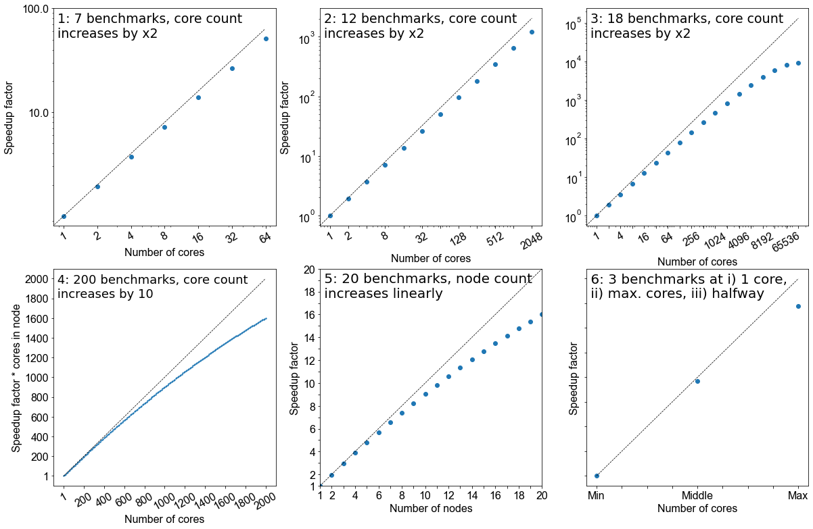
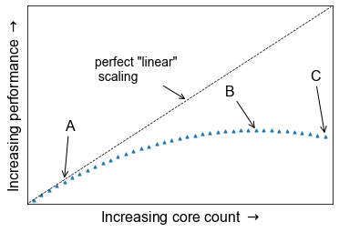
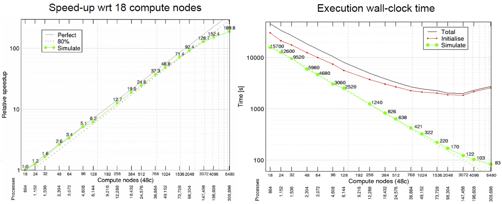
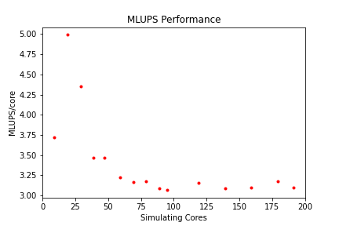
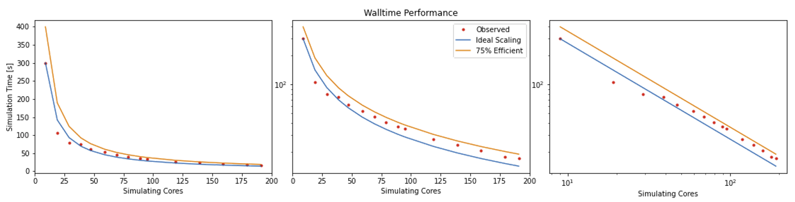
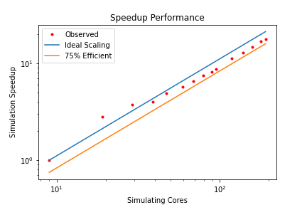

## What is benchmarking?

To get an idea of what we mean by benchmarking, let’s take the example of a sprint athlete. 
The athlete runs a predetermined distance on a particular surface, and a time is recorded. Based on different
conditions, such as how dry or wet the surface is, or what the surface is made of (grass, sand, or track) the times
of the sprinter to cover a distance (100m, 200m, 400m etc) will differ. If you know where the sprinter is running,
and what the conditions were like, when the sprinter sets a certain time you can cross-correlate it with the known 
times associated with certain surfaces (our benchmarks) to judge how well they are performing.

Benchmarking in computing works in a similar way: it is a way of assessing the performance of a program (or set of
programs), and benchmark tests are designed to mimic a particular type of workload on a component or system. They can
also be used to measure differing performance across different systems. Usually codes are tested on different computer
architectures to see how a code performs on each one. Like our sprinter, the times of benchmarks depends on a number
of things: software, hardware or the computer itself and it’s architecture.

> ## Callout: Local vs system-wide installations
>
> Whenever you get access to an HPC system, there are usually two ways to get access to
> software: either you use a system-wide installation or you install it yourself. For widely
> used applications, it is likely that you should be able to find a system-wide installation.
> In many cases using the system-wide installation is the better option since the system
> administrators will (hopefully) have configured the application to run optimally for
> that system. If you can't easily find your application, contact user support for the
> system to help you.
>
> For less widely used codes, such as HemeLB, you will have to compile the code on the HPC system
> for your own use. Build scripts are available to help streamline this process but these must be
> customised to the specific libraries and nomenclature of individual HPC systems.
>
> In either case, you should still check the benchmark case though! Sometimes system administrators are short
> on time or background knowledge of applications and do not do thorough testing. For locally compiled codes, the 
> default options for compilers and libraries may not necessarily be optimal for performance. Benchmark testing can
> allow the best option for that machine to be identified.
{: .callout}


## Creating a job file

HPC systems typically use a job scheduler to manage the deployment of jobs and their many different resource requests
from multiple users. Common examples of schedulers include SLURM and PBS. 

We will now work on creating a job file which we can run on {{ site.remote.name }}. Writing a job file from scratch is
error prone, and most supercomputing centres will have a basic one which you can modify. Below is a job file we can use
and modify for the rest of the course.

~~~

~~~
{: .source}

Particular information includes who submitted the jobs, how long it needs to run for, what resources are required
and which allocation needs to be charged for the job. After this job information, the script loads the libraries
necessary for supporting jobs execution. In particular, the compiler and MPI libraries need to be loaded. Finally the
commands to launch the jobs are called. These may also include any pre- or post-processing jobs that need to be run on
the compute nodes.

The example above submits a HemeLB job on 1 node that utilises 10 cores and runs for a maximum of 10 minutes. Where
indicated, modify the script to the correct settings for usernames and filepaths for your HPC system. It must be 
noted here that all HPC systems have subtle differences in the necessary commands to submit a job, you should consult 
your local documentation for definitive advice on this for your HPC system.

> ## Running a HemeLB job on your HPC
> 
> Examine the provided jobscript and run the job using `{{ site.sched.submit }} myjob.sh`. You can track the progress
> of the job using `{{ site.sched.status}} {{ site.sched.user }}
>
> This will take about 5 minutes.
>
{: .challenge}

While this job is running, lets examine the input file to understand the HemeLB job we have submitted.

```xml

```


The HemeLB input file can be broken into three main regions: 

1. **Simulation set-up**: specify global simulation information like discretisation parameters, total 
   simulation steps and initialisation requirements
2. **Boundary conditions**: specify the local parameters needed for the execution of the inlets and outlets of the
   simulation domain
3. **Property output**: dictates the type and frequency of dumping simulation data to file for post-processing

The actual geometry being run by HemeLB is specified by a geometry file, `bifurcation.gmy` which represents the 
splitting of a single cylinder into two. This can be seen as simplified representation of many vascular junctions
presented throughout the network of arteries and veins.

<p align="center"></p>

## Understanding your output files

Your job will typically generate a number of output files. Firstly, there will be job output and error files with names
which have been specified in the job script. These are often denoted with the submitted job name and the job number 
assigned by the scheduler and are usually found in the same folder that the job script was submitted from. 

In a successful job, the error file should be empty (or only contain system specific, non-critical warnings) whilst the
output file will contain the screen based HemeLB output.

Secondly, HemeLB will generate its file based output in the `results` folder - the specific name is listed in the
job script with the `-out` option. Here both summary execution information and property output is contained in the
folder `results/Extracted`. For further guide on using the [`hemeXtract`](https://github.com/UCL-CCS/hemeXtract) tool
please see the tutorial on the HemeLB website.

Open the file `results/report.txt` to view a breakdown of statistics of the HemeLB job you've just run. An example file
is provided below:

~~~

~~~
{: .source}


**Breakdown of key parts of report - sites/node, simulation vs total job time, other areas of interest.**

**EDITME** How to understand your output files, and gain understanding of where most time is spent. Use examples.


> ## Editing the submission script
>
> Make a directory called `2n-bif` and copy the input files and job script into used in the previous exercise into it.
> 
> Often we need to run simulations on a larger quantity of resources than that provided by a single node. For HemeLB, 
> this change does not require any modification to the source code to achieve. Here we can easily request more nodes 
> for our study by changing the resources requested in the job submission scripts. It is important that
> when changing the resources requested, ensure that you also modify the execution line to use the desired resources. 
> In {{ site.sched.name }}, this can be automated with the `{{ site.sched.ntasks }}` shortcut.
>
> Modify the appropriate section in your submission script and investigate the effect of changing requested resources.
>
{: .challenge}

## Benchmarking in HemeLB: A case study

In the next section we will look at how we can use all this information to perform a scalability study, but first
let us ensure the concepts of benchmarking are clear.

> ## The ideal benchmarking study
>
> Benchmarking is a process that judges how well a piece of software runs on a system. Based on what you have learned
> thus far from running your own benchmarks, which of the following would represent a good benchmarking analysis?
>
> <p align="center"></p>
>
> 1. 7 benchmarks, core count increases by factor of 2
> 2. 12 benchmarks, core count increases by factor of 2
> 3. 18 benchmarks, core count increases by factor of 2
> 4. 200 benchmarks, core count increases by 10
> 5. 20 benchmarks, node count increases linearly
> 6. 3 benchmarks; i) 1 core, ii) the maximum of cores possible, iii) a point at halfway
> 
> > ## Solution
> > 
> > 1. No, the core counts that are being benchmarked are too low and the number of points is not sufficient
> > 2. Yes, but depends on the software you are working with, how you want to use it, and how big your system is.
> >    This does not give a true view how scalable it is at higher core counts.
> > 3. Yes. If the system allows it and you have more cores at your disposal, this is the ideal benchmark to run. But
> >    as with #2, it depends on how you wish to utlise the software.
> > 4. No, although it increases by a factor of 10 to 2000 cores, there are too many points on the graph and therefore
> >    would be highly impractical. Benchmarks are used to get an idea of scalability, the exact performance will vary
> >    with every benchmark run.
> > 5. Yes. This is also a suitable metric for benchmarking, similar to response #3.
> > 6. No. While this will cover the spread of simulation possibilities on the machine, it will be too sparse to permit
> >    an appropriate characterisation of the the code on your system. Depending on the operational restrictions of your 
> >    system, full machine jobs may not be possible to run or may require a long time before it launches. 
> {: .solution}
{: .challenge}

**CW to edit: Benchmarking HemeLB**

## Scaling 

Going back to our athelete example from earlier, we may have determined the conditions and done a few benchmarks on
their performance over different distances, we might have learned a few things.

- how fast the athelete can run over short, medium and long distances
- the point at which the athelete can no longer perform at peak performance

In computational sense, scalability is defined as **the ability to handle more work as the size of the computer**
**application grows**. This term of scalability or scaling is widely used to indicate the ability of hardware and
software to deliver greater comptational power when the amount of resources is increased. When you are working on an
HPC cluster, it is very important that it is scalable, i.e. that the performance doesn't rapidly decrease the more 
cores/nodes that are assigned to a series of tasks.

Scalability can also be looked as in terms of parallelisation efficiency, which is the ratio between the actual
speedup and the ideal speedup obtained when using a certain number of processes. The overall term of speedup in HPC
can be defined with the formula `Speedup = t(1)/t(N)`.

Here, `t(1)` is the computational time for running the software using one processor and `t(N)` is the comptational time
running the software with N proceeses. An ideal situation is to have a linear speedup, equal to the number of
processors (speedup = N), so every processor contributes 100% of its computational power. In most cases, as an
idealised situation this is very hard to attain.

### Weak scaling vs Strong scaling

Applications can be divided into either **strong scaling** or **weak scaling** applications.

For **weak scaling**, the problem size increases as does the number of processors. In this situation, we usually want
to increase our workload without increasing our *walltime*, and we do that by using additional resources.

> ## Gustafson-Barsis' Law
>
> *Speedup should be measured by scaling the problem to the number of processes, not by fixing the problem size.*
> 
> `Speedup = s + p * N`
>
> where `s` is the proportion of the execution time spent on serial code, `p` is the amount of time spent on 
> parallelised code and `N` is the number of processes.
>
{: .callout}

For **strong scaling**, the number of processes is increased whilst the problem size remains the same, resulting in a
reduced workload for each processor. 

> ## Amdahl's Law
>
> The speedup is limited by the fraction of the serial part of the software that is not amenable to parallelisation
>
> `Speedup = 1/( s + p / N )`
> 
> where `s` is the proportion of the execution time spent on serial code, `p` is the amount of time spent on 
> parallelised code and `N` is the number of processes.
>
{: .callout}

Whether one is most concerned with strong or weak scaling can depends on the type of problem being studied and the resources 
available to the user. For large machines, where extra resources are relatively cheap, strong scaling ability can be more useful.
This allows problems to be solved more quickly. 

> ## Determine best performance from a scalability study
> 
> Consider the following scalability plot for a random application
> 
> <p align="center"></p>
> 
> At what point would you consider to be peak performance in this example.
>
> 1. A: The point where performance gains are no longer linear
> 2. B: The apex of the curve
> 3. C: The maximum core count
> 4. None of the above 
> 
> You may find that a scalability graph my vary if you ran the same code on a different machine. Why?
> 
> > ## Solution
> > 
> > 1. No, the performance is still increasing, at this point we are no longer achieving perfect scalability.
> > 2. Yes, the performance peaks at this location, and one cannot get higher speed up with this set up.
> > 3. No, peak performance has already been achieved, and increasing the core count will onlt reduce performance.
> > 4. No, although you can run extra benchmarks to find the exact number of cores at which the inflection point truly
> >    lies, there is no real purpose for doing so.
> >
> > Tying into the answer for #4, if you produce scalability studies on different machines, they will be different
> > because of the different setup, hardware of the machine. You are never going to get two scalability studies which
> > are identical, but they will agree to some point.
> {: .solution}
{: .challenge}

Scaling behaviour in computation is centred around the effective use of resources as you
scale up the amount of computing resources you use. An example of "perfect" scaling would
be that when we use twice as many CPUs, we get an answer in half the time. "Poor" scaling
would be when the answer takes only 10% less time when we double the CPUs. "Bad" scaling 
may see a job take longer to complete when more nodes are provided. This example is one of
**strong scaling**, where we have a fixed problem size and need to know how quickly we can 
solve it. The total workload doesn't change as we increase our resources. 

The behaviour of a code in this strong scaling setting is a function of both code design and 
hardware layout. "Good" strong scaling behaviour occurs when the time required for computing 
a solution outweighs the time taken for communication to occur. Less desirable scaling performance
is observed when this balance tips and communication time outweighs compute time. The point 
at which this occurs varies between machines and again emphasise the need for benchmarking.

HemeLB is a code that has demonstrated very good strong scaling characteristics on several 
large supercomputers up to full machine scale. **FIGURES here - files/SNG* plots** The plots below provide examples of such 
performance on the German machine SuperMUC-NG. These demonstrate how the performance varies 
between 864 and 309,120 CPU cores in terms of both walltime used in the simulation phase 
and the speed-up observed compared to the smallest number of cores used. 

<p align="center"></p>


> ## Plotting strong scalability
>
> Using the original job script run HemeLB jobs at least 6 different job sizes, preferably over 
> multiple nodes. For the size of job provided here, we suggest aiming for a maximum of around
> 200 cores. After each job, record the `Simulation Time` from the Report.txt file.
>
> Now that you have results for 1 core, 4 cores and 2 nodes, create a *scalability plot* with
> the number of CPU cores on the X-axis and the simulation times on the Y-axis (use your
> favourite plotting tool, an online plotter or even pen and paper).
>
> Are you close to "perfect" scalability?
>
{: .challenge}

In this exercise you have plotted performance against simulation time. However this is not
the only way to assess the scalability performance of the code on your machine. Speed-up is 
another commonly used measure. At a given core count, the speed-up can be computed by 

`Speedup = SimTimeAtLeastCores/SimTimeAtCurrentCores`

For a perfectly scaling code, the computational speed up will match the scale-up in cores used.
This line can be used as an 'Ideal' measure to assess local machine performance. It can also
be useful to construct a line of 'Good' scaling - 75% efficient for example - to further 
assist in performance evaluation. 

Some measure of algorithmic speed can also be useful for evaluating machine performance. For
lattice Boltzmann method based codes such as HemeLB, a common metric is MLUPS - Millions of 
Lattice site Updates Per Second - which is often expressed as a core based value and can be
computed by:

`MLUPS = (NumSites * NumSimulationSteps)/(1e6 * SimulationTime * Cores)`

When plotted over a number of simulation size for a given machine, this metric will display a
steady plateau in the regime where communication is masked by computation. When this declines, 
it illustrates when communication begins to take much longer to perform. The point at which this
occurs will depend on the size of the geometry used and the performance characteristics of the 
given machine. As an illustration we have generated examples of these plots for the test bifurcation
case on SuperMUC-NG. We have also illustrated the effect of different axes scaling can have on
presenting scaling performance. The use of logarithmic scales can allow scaling to be easily 
viewed but it can also make changes in values harder to assess. Linear scales make axes easier to 
interpret but can also make it harder to distinguish between individual points. **fig/plots**

<p align="center"></p>

<p align="center"></p>

<p align="center"></p>


These figures also highlight two other characteristics of assessing performance. In our SuperMUC-NG
results, the four data points at the lowest core counts appear to have better performance than that
at higher core counts. Here this is due to the the transition from one to multiple nodes on this machine 
and this has a consequence on communication performance. Similarly is the presence of some seemingly
unusual data results. The performance of computer hardware can be occasionally variable and a 
single non-performant core will impact the result of the whole simulation. This emphasises the need 
to repeat key benchmark tests to ensure a reliable measure of performance is obtained. 

### Weak scaling

For **weak scaling**, we want usually want to increase our workload without increasing
our *walltime*,
and we do that by using additional resources. (**EDIT ME NEEDS CHANGING BASED ON WHETHER THIS WILL BE KEPT**)
To consider this in more detail, let's head
back to our chefs again from the previous episode, where we had more people to serve
but the same amount of time to do it in.

We hired extra chefs who have specialisations but let us assume that they are all bound
by secrecy, and are not allowed to reveal to you
what their craft is, pastry, meat, fish, soup, etc. You have to find out what their
specialities are, what do you do? Do a test run and assign a chef to each course. Having
a worker set to each task is all well and good, but there are certain combinations which
work and some which do not, you might get away with your starter chef preparing a fish
course, or your lamb chef switching to cook beef and vice versa, but you wouldn't put
your pastry chef in charge of the main meat dish, you leave that to someone more
qualified and better suited to the job.

Scaling in computing works in a similar way, thankfully not to that level of detail
where one specific core is suited to one specific task, but finding the best combination
is important and can hugely impact your code's performance. As ever with enhancing
performance, you may have the resources, but the effective use of the resources is
where the challenge lies. Having each chef cooking their specialised dishes would be
good weak scaling: an effective use of your additional resources. Poor weak scaling
will likely result from having your pastry chef doing the main dish.

Weak scaling with HemeLB can be challenging to undertake as it is difficult to reliably
guarantee an even division of work between processors for a given problem. This is due
to the load partitioning algorithm used which must be able to deal with sparse and complex
geometry shapes.
