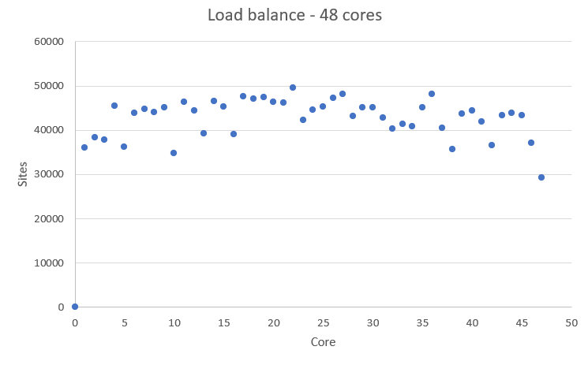
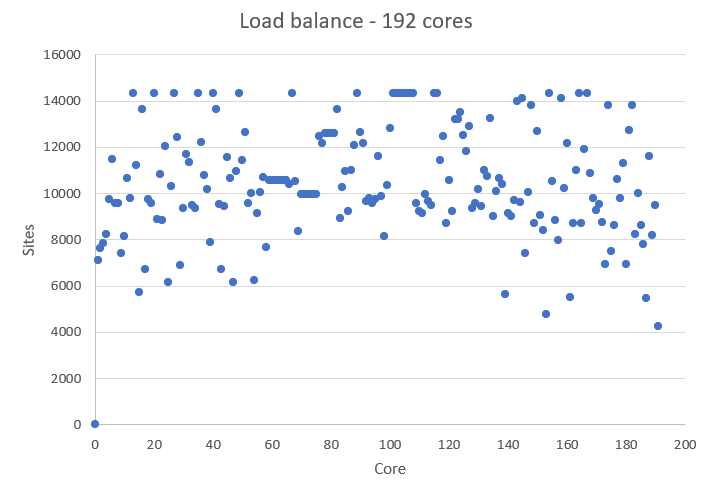
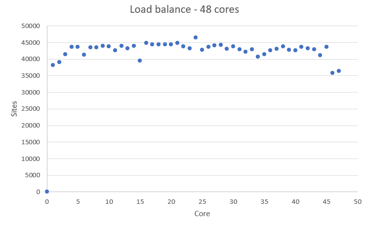
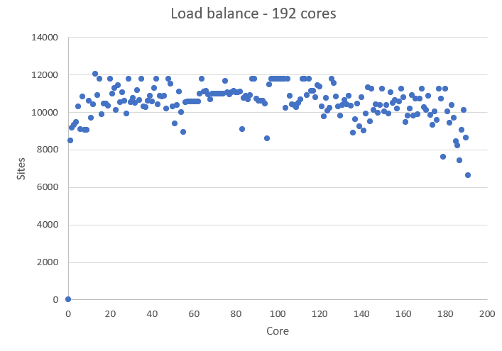
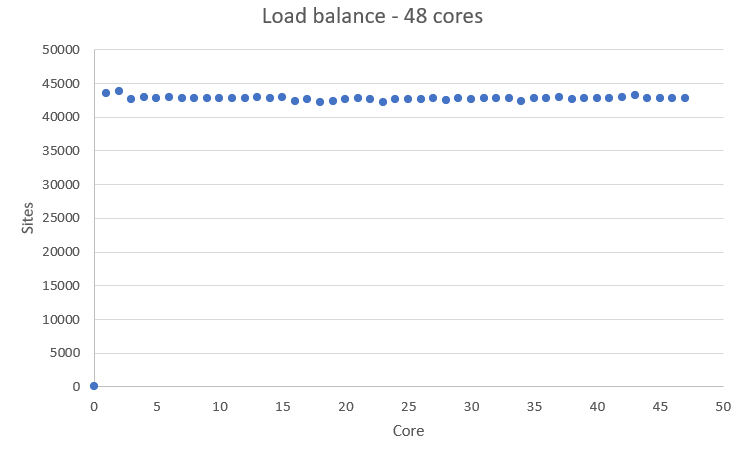
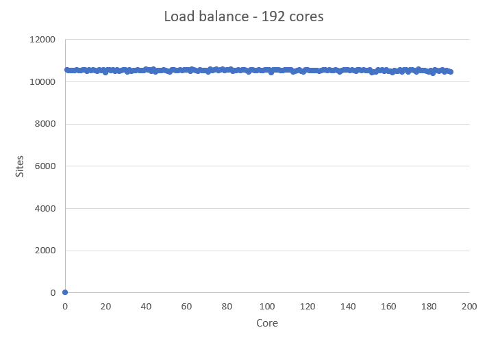

## How is HemeLB parallelised?

Before using any accelerator package to speedup your runs, it is always wise to identify performance **bottlenecks**.
The term "bottleneck" refers to specific parts of an application that are unable to keep pace with the rest of the
calculation, thus slowing overall performance.

Therefore, you need to ask yourself these questions:
* Are my runs slower than expected?
* What is it that is hindering us getting the expected scaling behaviour?

HemeLB distributes communicates between the multiple CPU cores taking part in a simulation 
through the use of MPI. One core acts as a '*master thread*' that coordinates the simulation
whilst the remaining '*workers*' are dedicated to solving the flow through their assigned 
sub-domains. It is important to note that the '*threads*' in this case are not the same as OpenMP and used as
a terminology. This work pattern can generate features of a simulation that could give rise 
to bottlenecks in performance. Other bottlenecks may arise from one's choice in simulation
parameters whilst others may be caused by the hardware on which a job is run.

In this episode, we will discuss some bottlenecks that may be observed within the use of HemeLB.

## Identify bottlenecks

Identifying (and addressing) performance bottlenecks is important as this could save you
a lot of computation time and resources. The best way to do this is to start with a reasonably
representative system having a modest system size and run for a few hundred/thousand
timesteps.

Benchmark plots - particularly for *speed-up* and *MLUPS/core* - can help identify when a potential
bottleneck becomes a problem for efficient simulation. If an apparent bottleneck is particularly
significant, timing data from a job can also be useful in identifying where the source of it 
may be. HemeLB has a reporting mechanism that we introduced in the 
[previous episode]({{page.root}}{% link _episodes/03-benchmarking-and-scaling.md}) that provides such 
information. This file gets written to `results/report.txt`.  

This file provides a wealth of information about the simulation you have conducted, including
the size of simulation conducted and the time spent in various sections of the simulation. The
breakdown of information provided here is described in the
[previous episode]({{page.root}}{% link _episodes/03-benchmarking-and-scaling.md}).

We will discuss three common bottlenecks that may be encountered with HemeLB:
- Load balance
- Writing data
- Choice of parameters

In some circumstances, the options available to overcome the bottleneck may be limited. But they
will provide insight into why the code is performing as observed, and can also help to ensure that 
accurate results are obtained.

## Load balancing

One important issue with MPI-based parallelization is that it can under-perform for systems with inhomogeneous
distribution of work between cores. It is pretty common that the evolution of simulated systems 
over time begin to reflect such a case. This results in **load imbalance**. While some of the processors are assigned 
with a finite number of lattice sites to deal with for such systems, a few processors could have far fewer sites to
update. The progression of the simulation is held up by the core with the most work to do and this results in an
overall loss in parallel efficiency if a large imbalance is present. This situation is more likely to expose itself as
you scale up to a large large number of processors for a fixed number of sites to study.

In the HemeLB results file, the number of sites assigned to each core is reported near the top of the file and can 
be used to check for signs of significant imbalance between cores. For example we plot below how HemeLB has distributed
the workload of the bifurcation geometry on 48 and 192 cores. Note in both cases that rank 0 has no sites assigned to
it. As the speed of a simulation is governed by the core with the most work to do, we do not want to see a rank that 
has significantly more sites than the others. Cores with significantly less workload should not hold up a simulation's
progression but will be waiting for other cores to complete and thus wasting its computational performance potential.
The success of a distribution will depend on the number of cores requested and the complexity of the domain. 


<p align="center"></p>

<p align="center"></p>


In general, the default load distribution algorithm in HemeLB has demonstrated good performance except in extreme
circumstances. This default algorithm however does assume that each node type: `Bulk fluid`, `Inlet`, `Outlet`, `Wall`;
all require the same amount of computational work to conduct and this can generate imbalance, particularly when there 
are a large number of non-bulk sites present in a geometry. HemeLB has a tool available to help correct this imbalance
by assigning weights to the different site types in order to generate a more even distribution, this converts the
geometry data format from `*.gmy` to `*.gmy+`.


> ## Compiling and using gmy2gmy+
> 
> 1. Download the code for the gmy2gmy+ converter from [`files/gmy2gmy+`]({{page.root}}{% link files/gmu2gmy+}) and
>    compile it on your machine. This script is run with the following instruction (where `DOMAIN` is your test domain 
>    name):
> 
>    ~~~
>    ./gmy2gmy+ DOMAIN.gmy DOMAIN.gmy+ 1 2 4 4 4 4 
>    ~~~
>    {: .source}
>
>    This assigns a simple weighting factor of 1 to *fluid nodes*, 2 to *wall nodes* and 4 to variants of *in/outlets*.
>
> 2. Recompile HemeLB so that it knows to read `gmy+` files. To keep your old executable, rename the 
>    `build` folder to `buildGMYPLUS`. Edit the build script in `buildGMYPLUS`to include the option;
>
>    ~~~
>    -DHEMELB_USE_GMYPLUS=ON
>    ~~~
>    {: .source} 
>    
> 3. Use the tool to convert `bifurcation.gmy` into the new `gmy+` format.
>
>
{: .challenge}

An example of the improved load balance using the gmy+ format are shown below:

<p align="center"></p>


<p align="center"></p>


> ## Testing the performance of gmy+
> 
> Repeat the benchmarking tests conducted in the 
> [previous episode]({{ page.root }}{% link _episodes/03-benchmarking-and-scaling.md}) using the `gmy+` format. You
> will need to edit the `input.xml` file accordingly) and compare your results. Also examine how load distribution has
> changed as a result in the `report.txt` file.
>
> Try different choices of the weights to see how this impacts your results.
>
{: .challenge}

### Using the ParMETIS library

Another option for improving the load balance of HemeLB is to make use of the **ParMETIS** library that was built
as a dependency in the initial compilation of the code. To do this you will need to recompile the source code 
with the following option enabled: `-DHEMELB_USE_PARMETIS=ON`. This tool takes the load decomposition generated 
by the default HemeLB algorithm and then seeks to generate an improved decomposition.

<p align="center"></p>


<p align="center"></p>

As can be seen, using ParMETIS can generate a near perfect load distribution. Whilst this may seem like an 
ideal solution it does come with potential drawbacks. 

1. **Memory Usage:** Some researchers have noted that ParMETIS can demand a large amount of memory during its operation
                     and this can become a limiting factor on its use as domains become larger. 
2. **Performance Improvement:** With any of the suggested options for improving load balance, it is important to assess
                                how much performance gain has been achieved through this change. This should be 
                                assessed in two metrics: 

                                - Simulation Time: This looks at the time taken for the requested iterations to 
                                                   complete and is the value used for assessing scaling previously. 
                                - Total Walltime: Includes both the Simulation Time and the time needed to initialise 
                                                  the simulation. The use of extra load balancing tools requires the
                                                  extra initialisation time and it needs to be judged whether this
                                                  extra cost is merited in terms of the achieved improvement in 
                                                  Simulation Time. 

As many HPC systems charge for the Total Walltime of a job, it is inefficient to use a tool 
that causes this measure to increase. For small geometries, the initialisation time of HemeLB can be very quick
(a few seconds) but for larger domains with multiple boundaries, this can extend to tens of minutes.

> ## Testing the performance of gmy+ and ParMETIS
> 
> Repeat the benchmarking tests conducted in Episode 1 using the gmy+ and ParMETIS (edit the input.xml file so that it is 
> looking for the gmy+ file when testing this, save as a separate file; when testing ParMETIS the original `input.xml` file
> can be used).
> and compare your results. Also examine how load distribution has changed as a result in the report.txt file.
>
> Try different choices of the gmy+ weights to see how this impacts your results.
> See how your results vary when a larger geometry is used (see **FOLDERPATHHERE** for `gmy` and input files).
> 
> > ## Example Results
> > 
> > Note that exact timings can vary between jobs, even on the same machine - you may see different performance. 
> > The relative benefit of using load balancing schemes will vary depending on the size and complexity of the domain,
> > the length of your simulation and the available hardware.
> > 
> > | Scheme   | Cores | Initialisation Time (s) | Simulation Time (s) | Total Time (s) |
> > |-----------------------------------------------------------------------------------|
> > | Default  | 48    | 0.7                     |     56.0            | 56.7           |
> > | Default  | 192   | 1.0                     |     15.3            | 16.3           |
> > | GMY+     | 48    | 0.7                     |     56.1            | 56.8           |
> > | GMY+     | 192   | 1.0                     |     13.2            | 14.2           |
> > | ParMETIS | 48    | 2.6                     |     56.7            | 59.3           |
> > | ParMETIS | 192   | 2.4                     |     12.5            | 14.9           |
> > |-----------------------------------------------------------------------------------|
> > 
> {: .solution} 
{: .challenge}


## Data writing

With all simulations, it is important to get output data to assess how the simulation has performed and to investigate
your problem of interest. Unfortunately, writing data to disk is a cost that can negatively impact on simulation 
performance. In HemeLB, output is governed by the 'properties' section of the input file. 

```xml

```

In this example, we output pressure and velocity information at the inlet and outlet surfaces of our domain every 100 
steps and for the whole simulation domain every 1000 steps. This data is written to compressed `*.dat` files in 
`results/Extracted`. It is recommended that the `whole` option is used with caution as it can generate **VERY** large 
`*.dat` files. The larger your simulation domain, the greater the effect of data writing will be.

> ## Testing the effect of data writing
>
> Repeat the benchmarking tests conducted in Episode 1 now outputting inlet/outlet and whole data at a number of different
> time intervals. Compare your results to those obtained in Episode 1. Given output is critical to the simulation process
> what would be a suitable strategy for writing output data?
>
> Below we provide some example results obtained on SuperMUC-NG by writing the whole data set at different time intervals. The 
> impact on performance is clear to observe. 
>
{: .challenge}


> ## Effect of model size
> 
> In **refer to folder** you can find a higher resolution model ( ≈ 4 times larger **TODO confirm**) of the bifurcation 
> model we have been studying. Repeat some of the exercises on load balancing and data writing to see how a larger model 
> impacts the performance of your system.
>
{: .challenge}

## Choice of simulation parameters

With most simulation methods, results that accurately represent the physical system being studied can only be achieved if suitable
parameters are provided. When this is not the case, the simulation may be unstable, it may not represent reality or both. Whilst 
the choice of simulation parameters may not change the algorithmic speed of your code, they can impact how long a simulation needs 
to run to represent a given amount of physical time. The lattice Boltzmann method, on which HemeLB is based, has specific restrictions 
that link the discretization parameters, physical variables and simulation accuracy and stability.

In these studies, HemeLB is using a single relaxation time (or BGK) collision kernel to solve the fluid flow. In this model 
viscosity, lattice spacing, and simulation timestep are related to the relaxation parameter &tau; by,

&nu; = <sup>1</sup>/<sub>3</sub>(&tau; - &frac12;) <sup>&Delta;x<sup>2</sup></sup>/<sub>&Delta;t</sub>
 
Here:

* &nu; - Fluid viscosity [m<sup>2</sup>/s] - in HemeLB this is set to 4x10<sup>-6</sup> m<sup>2</sup>/s the value for human blood
* &Delta;x - Lattice spacing [m]
* &Delta;t - Time step [s]

This relationship puts physical and practical limits on the values that can be selected for these parameters. In particular,
&tau; > &frac12; must be imposed for a physical viscosity to exist, values of &tau; very close to &frac12; can be
unstable. Generally, a value of &tau; ≈ 1 gives the most accurate results.

The lattice Boltzmann method can only replicate the Navier-Stokes equations for fluid flow in a low Mach number regime. In
practice, this means that the maximum velocity of the simulation must be significantly less than the speed of sound of the
simulation. As a rough rule of thumb, the following is often acceptable in simulations (though if smaller Ma can be achieved, 
this is better):


Ma = <sup>(3u<sub>max</sub>*&Delta;t)</sup>&frasl;<sub>&Delta;x</sub>

Often the competing restrictions placed on a simulation by these two expressions can demand a small time step to be used.

 
> ## Determining your physical parameters 
>
> Suppose you wish to simulate blood flow through a section of the aorta with a maximum velocity of 1 m/s for a period of 
> two heartbeats (2 seconds). Using the expressions above, determine suitable choices for the time step if your geometry
> has a grid resolution of &Delta;x = 100 &mu;m. 
>
> How many iterations do you need to run for this choice? How do your answers
> change if you have higher resolutions models with (i) &Delta;x = 50 &mu;m and (ii) &Delta;x = 20 &mu;m$? What would be the 
> pros and cons of using these higher resolution models?
>
> > ## Solution
> >
> > Starting points would be the following, these would likely need further adjustment in reality:
> >
> > - For &Delta;x = 100 &mu;s, &Delta;t = 5 &mu;s gives Ma ≈ 0.087 and &tau; = 0.506; 400,000 simulation steps required 
> > - For &Delta;x = 50 &mu;s, &Delta;t = 2.5 &mu;s gives Ma ≈ 0.087 and &tau; = 0.512; 800,000 simulation steps required 
> > - For &Delta;x = 20 &mu;s, &Delta;t = 1 &mu;s gives Ma ≈ 0.087 and &tau; = 0.530; 2,000,000 simulation steps required 
> > 
> > Higher resolution geometries have many more data points stored within them - halving the grid resolution requires approximately
> > 8x more points and will take roughly 16x longer to simulate for the same Ma and physical simulation time. Higher resolution 
> > domains also generate larger data output, which can be more challenging to analyse. The output generated should also be a more 
> > accurate representation of the reality being simulated and can achieve more stable simulation parameters. 
> {: .solution}
{: .challenge}


######################################
## Original material, kept if anything useful or missed
- Does HemeLB have a timing breakdown table?

Based on this breakdown table we will work on a few examples and try to
understand how to identify bottlenecks from this output. Ultimately, we will try to find
a way to minimise the walltime by adjusting ****EDITME (what?)****

> ## Important!
> For many of these exercises, the exact modifications to job scripts that you will need
> to implement are system
> specific. Check with your instructor or your HPC institution's helpdesk for information specific
> to your HPC system.
>
{: .callout}

> ## Example timing breakdown for small system
> Using your previous job script for a a *serial* run (i.e. on a single core), replace
> the input file with the one for the **small** system and run it on the HPC system.
>
> Take a look at the resulting timing breakdown table and discuss with your neighbour
> what you think you should target to get a performance gain.
>
> > ## Solution
> > 
> {: .solution}
{: .challenge}

## Effects due to system size on resource used

Different sized systems might behave differently
as we increase our resource usage since they will have different distributions of work
among our available resources.

> ## Analysing the small system
>
> Below is an example timing breakdown for 4000 atoms LJ-system with 40 MPI ranks
>
> ~~~
> MPI task timing breakdown:
> Section |  min time  |  avg time  |  max time  |%varavg| %total
> ---------------------------------------------------------------
> Pair    | 0.24445    | 0.25868    | 0.27154    |   1.2 | 52.44
> Neigh   | 0.045376   | 0.046512   | 0.048671   |   0.3 |  9.43
> Comm    | 0.16342    | 0.17854    | 0.19398    |   1.6 | 36.20
> Output  | 0.0001415  | 0.00015538 | 0.00032134 |   0.0 |  0.03
> Modify  | 0.0053594  | 0.0055818  | 0.0058588  |   0.1 |  1.13
> Other   |            | 0.003803   |            |       |  0.77
> ~~~
> {: .output}
>
> Can you discuss any observations that you can make from the above table? What could
> be the rationale behind such a change of **EDITME something**
>
> > ## Solution
> >
> {: .solution}
{: .discussion}

> ## Analysing the large system
>
> > ## Solution
> >
> {: .solution}
{: .discussion}

## Scalability

Since we have information about the timings for different components of the calculation,
we can perform a scalability study for each of the components.

> ## Investigating scalability on a number of nodes
>
> > ## Solution
> > 
> {: .solution}
{: .challenge}

## MPI vs OpenMP

- **EDITME - bottleneck identified, now how do you implement solving it**

Let us discuss a few situations:


Let us now build some hands-on experience to develop some feeling on how this works.

> ## Case study: System 1
>
{: .callout}

## Load balancing
One important issue with MPI-based
parallelization is that it can under-perform for systems with inhomogeneous
distribution of particles, or systems having lots of empty space in them. It is pretty
common that the evolution of simulated systems evolve over time to reflect such a case.
This results in *load imbalance*. While some of the processors are assigned with
finite number of
particles to deal with for such systems, a few processors could have far less atoms (or
none) to do any calculation and this results in an overall loss in parallel efficiency.
This situation is more likely to expose itself as you scale up to a large
large number of processors.


> ## Example timing breakdown for system
>
> > ## Solution
> > 
> {: .solution}
{: .discussion}
