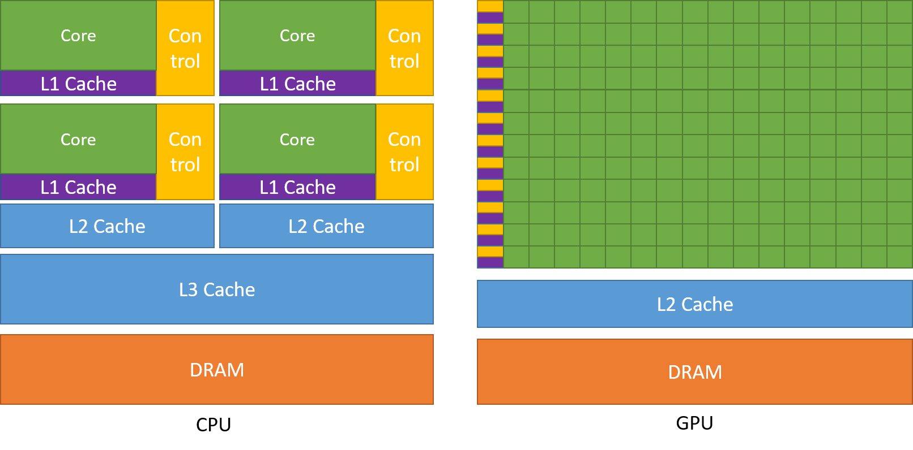
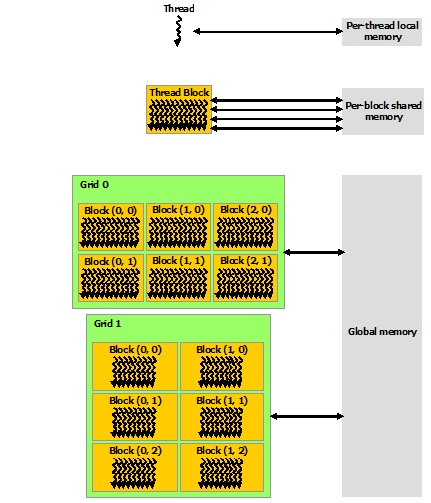
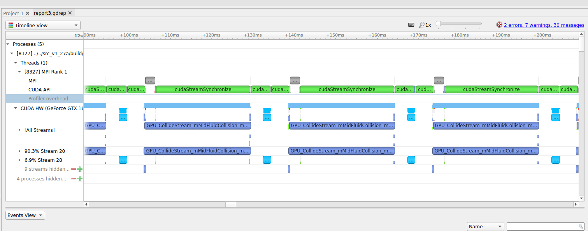
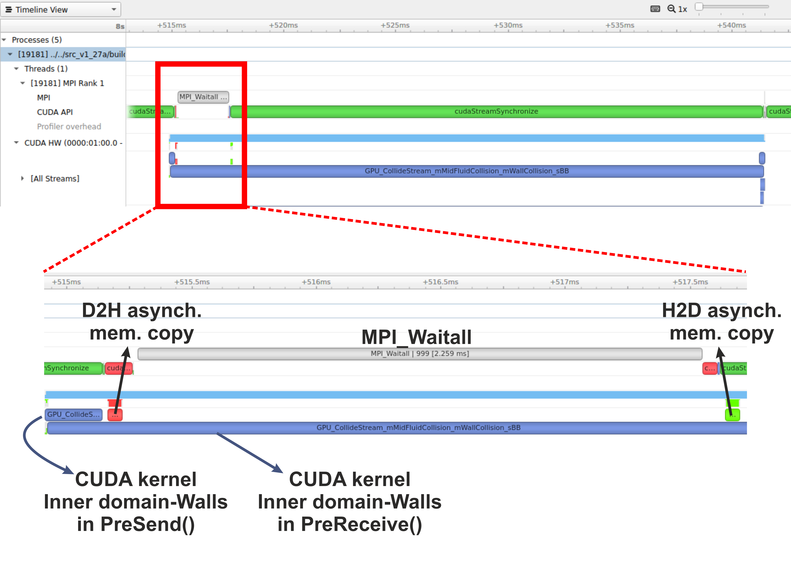

## Why do we need GPUs?

A Graphics Processing Unit (GPU) is a type of specialised processor originally designed to accelerate
graphics rendering, this includes video games. GPUs can have thousands of cores, which can perform tasks
simultaneously, which at the time was very helpful for creating pixels on a screen for gaming purposes.

Imagine you were playing a game using a CPU, which only has a handful of cores, compared to a GPU, which has
thousands, you can get an idea why a GPU is more fit for purpose in that way. However, it was gradually realised
that a GPU can also be used to accelerate other types of calculations as well, involving massive amounts of data,
due to the way that it is designed to operate. 

Top level GPUs nowadays, such as the NVIDIA A100 GPU has 6912 CUDA cores and 432 Tensor cores. A CUDA core is the
NVIDIA version of a CPU core, and which can run CUDA code. A Tensor core is a more advanced core which is
fundamental to AI and deep learning workflows, using such libraries as (TensorFlow)[https://www.tensorflow.org/]. 
We will not discuss any further differences between these two now, but what you need to remember and understand is
that a GPU has much more processing power than a CPU to complete a given task. 

If you need to perform a task on massive amounts of data, then the same analysis (calculations - set of code)
will be executed on/for each one of the elements/data that we have. A CPU would have to go through each one of the 
elements in a serial manner, i.e. perform the analysis on the first element, once finished move to the next one and
so on and so forth, until it manages to process everything. A GPU on the other hand, will do this in parallel
(large scale parallelism), depending on how may cores it has. The same mathematical function
will run over and over again but at a large scale, offering significant speed-up to the calculations.   

A nice demonstration of the above was given by the [MythBusters](https://www.youtube.com/watch?v=0udMBdo0Rac) at an
NVIDIA conference in 2008. Although it is a big oversimplication of the internal processes and communications between
a CPU and a GPU, it gives an ideal as to why GPUs are regarded so highly.

Hence, in scientific computing, with GPUs we can achieve massive acceleration of our calculations. That is why GPUs
are becoming commonplace on high-end HPC machines, with a number of GPUs installed on each node.  

The schematic Figure from NVIDIA [documentation](https://docs.nvidia.com/cuda/cuda-c-programming-guide/index.html)
shows an example distribution of chip resources for a CPU versus a GPU. 

It is worth noting however that even though GPUs have more cores than a CPU, and can technically do things much
quicker, their main disadvantage is their low memory, and this limits them to doing small, albeit vast amounts of
smaller calculations at once. So you would not want to have a GPU running a long and complex calculation on a single
core, as it will likely run out of memory and waste using a GPU in the first place, therefore a CPU is more practical.

> ## CPUs vs GPUs
> 
> Look at the table below on the main differences between CPUs and GPUs. Some of these values are true and some
> are false. Spend a few minutes sorting through them to match the answer to the correct column.
> 
> | CPU                                            | GPU                                    |
> |-----------------------------------------------------------------------------------------|
> | Central Processing Unit                        | Graphics Processing Unit               |
> | Many cores                                     | Several cores                          |
> | Low latency                                    | High throughput                        | 
> | Good for parallel processing                   | Good for serial processing             | 
> | Handful of operations at once                  | Thousands of operations at once        | 
> | Consumes/needs more memory                     | Requires less memory                   |
> | Lower speed                                    | Higher speed                           |
> | Weak cores                                     | Powerful cores                         |
> | Complements main brain to perform calculations | Considered as main 'brain' of computer |
> | Explicit management of threads                 | Threads managed by hardware            |
> | Data Parallelism                               | Task Parallelism                       |
> | Few highly optimised instructions              | Diverse instruction sets               |
> |-----------------------------------------------------------------------------------------|
> 
> > ## Solution
> > 
> > | CPU                                    | GPU                                            |
> > |-----------------------------------------------------------------------------------------|
> > | Central Processing Unit                | Graphics Processing Unit                       |
> > | Several cores                          | Many cores                                     |
> > | Low latency                            | High throughput                                | 
> > | Good for serial processing             | Good for parallel processing                   | 
> > | Handful of operations at once          | Thousands of operations at once                | 
> > | Consumes/needs more memory             | Requires less memory                           |
> > | Lower speed                            | Higher speed                                   |
> > | Powerful cores                         | Weak cores                                     |
> > | Considered as main 'brain' of computer | Complements main brain to perform calculations |
> > | Explicit management of threads         | Threads managed by hardware                    |
> > | Task Parallelism                       | Data Parallelism                               |
> > | Diverse instruction sets               | Few highly optimised instructions              |
> > |-----------------------------------------------------------------------------------------|
> > 
> {: .solution}
{: .challenge}

## CUDA Programming Basics

The most important concept to have in mind when it comes to CUDA and GPU programming, is that the compute 
intensive parts of a code can be ported onto the GPU (device) for the calculations to take place for a fraction of the
time it would take to complete on a CPU. Following that, the results are then returned back to the CPU (host). Hence, 
the developer needs to implement what are known as GPU CUDA kernels, which are the functions for doing the calculations 
on the GPU, but also arrange: 
- the data transfers to and from the GPU, as well as 
- the synchronisation points, i.e. when to stop the code moving past a given point until a certain task on the GPU 
  has been completed.

With the above in mind, a typical workflow for a CUDA C++ program is:
1. Declare and allocate host (CPU) and device (GPU) memory.
2. Initialize host (CPU) data.
3. Transfer data from the host (CPU) to the device (GPU).
4. Execute one or more CUDA kernels (the computations to be performed on the GPU).
5. Transfer results from the device (GPU) back to the host (CPU). 

### GPU CUDA kernel - CUDA function

CUDA programming can take a bit to get used to and as yet there are no Carpentries style resources for CUDA programming
available, however here we will provide a brief lookover at the main functionalities and differences.

The specifier `__global__` is added in front of the function, which tells the CUDA C++ compiler that this is a function 
that runs on the GPU and can be called from CPU code. The remainder of the code will be relatively similar, however
when you are defining your function, the keyword will be required to run the function on a GPU. A full example of
defining a GPU CUDA kernel would be as follows;

~~~
__global__ void GPU_Cuda_Kernel_Name(kernel's_arguments)
~~~
{: .source}

### GPU Memory Hierarchy - Memory Allocation in CUDA

Before we carry onto how to launch a kernel, we need to discuss the memory hierarchy of a GPU, as an understanding of
it is crucial to getting a CUDA code to actually run and work. In CUDA, the kernel is executed with the aid of CUDA
threads, arranged in groups (blocks). Each thread is given a unique thread ID, which is accessible within the GPU kernel through built-in variables. 
CUDA defines the following built-in variables: `blockDim`, `blockIdx`, and `threadIdx`, which are predefined variables of type `dim3`. 
`blockDim` contains the dimensions of each thread block, while `threadIdx` and `blockIdx` contain the index of the thread within its thread block and the thread block within the grid, respectively. 

Using the thread's index we can access different GPU memory locations, either for loading or writing data.      
Each thread has also a private local memory. NVIDIA's [documentation](https://docs.nvidia.com/cuda/cuda-c-programming-guide/index.html) 
page gives a good overview.

One thread is never enough though when dealing with GPUs, as threads come in thread blocks, 
which can be executed in serial or parallel. Depending on the GPU you are utilising, a thread block can contain a maximum of either
512 or 1024 of these threads.

Each thread block has shared memory visible to all threads of the block and with the same lifetime as the block. All
threads have access to the same global memory. An overview of the memory Hierarchy is outlined below.

### Launching the GPU kernel

The GPU CUDA kernel is launched by using a specific syntax, the **triple angle bracket** `<<< >>>`. This will inform
the compiler that the kernel that follows is a GPU kernel and will therefore be executed on the GPU. The information
between the triple angle brackets is the execution configuration, which determines how many threads on the device (GPU) 
will execute the kernel in parallel. These threads are arranged in what are thread blocks, hence the developer should
specify how many threads there are per block. 
The number of threads per block should be a round multiple of 32 (the warp size).

An example of a launching a GPU CUDA kernel (`GPU_Cuda_Kernel_Name`) is as follows: 

~~~
// Cuda kernel set-up
int nThreadsPerBlock = 128; //Number of threads per block
dim3 nThreads(nThreadsPerBlock);
 
// Number of BLOCKS needed 
int nBlocks = (number_of_Elements)/nThreadsPerBlock	+ ((number_of_Elements % nThreadsPerBlock > 0) ? 1 : 0);

// Launch the GPU CUDA kernel
GPU_Cuda_Kernel_Name <<< nBlocks, nThreads >>> (Provide_Arguments_here); 
~~~
{: .source}

The first argument in the execution configuration; `GPU_Cuda_Kernel_Name <<< nBlocks, nThreads>>>` specifies the 
number of thread blocks (`nBlocks`), while (`nThreads`) specifies the number of threads in a thread block.

Remember that CUDA kernel launches don’t block the calling CPU thread. This means that once the kernel is launched,
the control is returned to the CPU thread and the code will resume. In order to ensure that the GPU kernel has
completed its task, a synchronsation barrier might be needed using `cudaDeviceSynchronize()`.

NVIDIA's website provides plentiful discussions and simple  
[examples](https://developer.nvidia.com/blog/easy-introduction-cuda-c-and-c/) and guides on the NVIDIA 
[CUDA Toolkit](https://docs.nvidia.com/cuda/cuda-c-programming-guide/index.html). We will not 

## CUDA Streams and Concurrency 

A CUDA kernel when launched is placed in the default CUDA stream. A CUDA stream is like an execution path. All 
operations in the same stream need to be completed and executed in order, before moving forward.

It is also possible, however, to launch kernels in different CUDA streams and by doing so these kernels may execute
out of order with respect to one another or concurrently. An example of a launching a GPU CUDA kernel
(`GPU_Cuda_Kernel_Name`) in a specified CUDA stream (name of stream `CUDA_stream_ID`) is provided here: 

~~~
// Launch the GPU CUDA kernel in stream CUDA_stream_ID
GPU_Cuda_Kernel_Name <<< nBlocks, nThreads, 0, CUDA_stream_ID >>> (Provide_Arguments_here); 
~~~
{: .source}

## Data Transfers in CUDA C/C++

As mentioned above, when performing calculations on the GPU, memory needs to be allocated onto the GPU 
(`cudaMalloc()`); then data that will be processed needs to be copied from the host to the device 
(`cudaMemcpyHostToDevice`), perform the calculations (execute the CUDA kernels on the device/GPU) and finally copy
the results from the device to the host (`cudaMemcpyDeviceToHost`). Data transfers are performed using `cudaMemcpy`
function. The syntaxt of `cudaMemcpy` is as follows:

`cudaMemcpy(void *dst, void *src, size_t count, cudaMemcpyKind kind)`

`cudaMemcpyKind` is either `cudaMemcpyHostToDevice` or `cudaMemcpyDeviceToHost`. The 2 possible kinds of CUDA memory
copies are:

a. H2D: from the Host (CPU) to the Device (GPU)

`cudaMemcpy(d_A, h_A, size_of_h_A_in_Bytes, cudaMemcpyHostToDevice)`

b. D2H: from the Device (GPU) to the Host (CPU)

`cudaMemcpy(h_A, d_A, size_of_d_A_in_Bytes, cudaMemcpyDeviceToHost)`

These memory copies can be Synchronous (as above) or Asynchronous (`cudaMemcpyAsync`). In the case of asynchronous
memory copy, the developer should provide the CUDA stream as a last argument to the `cudaMemcpyAsync` function call.
This allows overlapping the memory copies with other operations (kernels or mem.copies) on the GPU running on different
CUDA streams.     

## Simple CUDA code example
Here, we provide a simple example of a CUDA code. It contains the main features discussed above: allocate input vectors
in host memory and initialise them, allocate memory on the GPU, memory copies (H2D and D2H), defining and launching a 
GPU CUDA kernel.  

- D2H: from the Device (GPU) to the Host (CPU) 
- H2D: from the Host (CPU) to the Device (GPU)

~~~
// Device code
__global__ void VecAdd(float* A, float* B, float* C, int N)
{
    int i = blockDim.x * blockIdx.x + threadIdx.x;
    if (i < N)
        C[i] = A[i] + B[i];
}
            
// Host code
int main()
{
    int N = ...;
    size_t size = N * sizeof(float);

    // Allocate input vectors h_A and h_B in host memory
    float* h_A = (float*)malloc(size);
    float* h_B = (float*)malloc(size);

    // Initialize input vectors
    ...

    // Allocate vectors in device memory
    float* d_A;
    cudaMalloc(&d_A, size);
    float* d_B;
    cudaMalloc(&d_B, size);
    float* d_C;
    cudaMalloc(&d_C, size);

    // Copy vectors from host memory to device memory
    cudaMemcpy(d_A, h_A, size, cudaMemcpyHostToDevice);
    cudaMemcpy(d_B, h_B, size, cudaMemcpyHostToDevice);

    // Invoke kernel
    int threadsPerBlock = 256;
    int nblocks = (N + threadsPerBlock - 1) / threadsPerBlock;
    VecAdd<<<nblocks, threadsPerBlock>>>(d_A, d_B, d_C, N);

    // Copy result from device memory to host memory
    // h_C contains the result in host memory
    cudaMemcpy(h_C, d_C, size, cudaMemcpyDeviceToHost);

    // Free device memory
    cudaFree(d_A);
    cudaFree(d_B);
    cudaFree(d_C);
            
    // Free host memory
    ...
}
~~~
{: .source}

As mentioned above, when performing calculations on the GPU, memory needs to be allocated onto the GPU; then data that
will be processed needs to be copied from the host to the device, perform the calculations for the CUDA memory copies:

##  Compile CUDA code
CUDA code (typically in a file with extension `.cu`) can be compiled using the `nvcc` compiler. 
For example

~~~
nvcc CUDA_code.cu -o CUDA_code
~~~
{: .source}

> ## Memory allocation in CUDA
> 
> As mentioned earlier, one of the limitations regarding using GPUs is their memory.
> Memory should be allocated on the GPU, as the data processed during calculations on the GPU should physically
> reside on the GPU. Hence, we should ensure that there is sufficient GPU memory for the type of calculations that
> we would like to execute. For example, the NVIDIA Tesla P100 has 16 GB of memory, the V100 comes in 16 and 32GB
> configurations, while the A100's specs are enhanced further by providing a 40 GB and 80 GB configurations. 
> 
> Useful information regarding the type/s of NVIDIA GPUs installed on a node and their specs can be obtained using
> functionalities provided by NVIDIA (using `cudaGetDeviceProperties`). 
>
> For example, we can query the GPUs' properties using the following in our code:
> 
> ~~~
> // Get the GPUs properties:
> //    Device name, Compute Capability, Global Memory (GB) etc
> int nDevices;
> cudaGetDeviceCount(&nDevices);
> for (int i = 0; i < nDevices; i++) {
>     cudaDeviceProp prop;
>     cudaGetDeviceProperties(&prop, i);
>     printf("Device Number: %d\n", i);
>     printf("  Device name:        %s\n", prop.name);
>     printf("  Compute Capability: %d.%d\n", prop.major, prop.minor);
>     printf("  Total Global Mem:   %.1fGB\n\n", ((double)prop.totalGlobalMem/1073741824.0));
>     printf("  Memory Clock Rate (KHz): %d\n",
>            prop.memoryClockRate);
>     printf("  Memory Bus Width (bits): %d\n",
>            prop.memoryBusWidth);
>     printf("  Peak Memory Bandwidth (GB/s): %f\n\n",
>            2.0*prop.memoryClockRate*(prop.memoryBusWidth/8)/1.0e6);
>
>     printf("  Max Number of Threads per Block:  %d\n", prop.maxThreadsPerBlock);
>     printf("  Max Number of Blocks allowed in x-dir:  %d\n", prop.maxGridSize[0]);
>     printf("  Max Number of Blocks allowed in y-dir:  %d\n", prop.maxGridSize[1]);
>     printf("  Max Number of Blocks allowed in z-dir:  %d\n", prop.maxGridSize[2]);
>     printf("  Warp Size:  %d\n",  prop.warpSize);
>     printf("===============================================\n\n");
> }
> ~~~
> {: .source}
>
> Refer to the more complete example of the CUDA code located [here](), 
> and;
> 
> - Identify the section of the code which refers to memory allocation
> - Determine how much GPU memory will be required
>
>> ## Solution
>> 
>> ~~~
>> float* d_A;
>> cudaMalloc(&d_A, size);
>> float* d_B;
>> cudaMalloc(&d_B, size);
>> float* d_C;
>> cudaMalloc(&d_C, size);
>> ~~~
>> {: .source}
>>
>> Here we request memory for 3 vectors, with the total being `3*N*sizeof(float)` in bytes; see the 
>> part `cudaMalloc(&d_A to &d_C, size);`. 
> {: .solution}
{: .challenge}

## Profiling CUDA code
Profiling the CUDA code can be done using tools provided by NVIDIA. **NVIDIA Nsight Systems** for GPU and CPU sampling
and tracing and **NVIDIA Nsight Compute** for GPU kernel profiling. 

A more detailed description on the above tools can be provided from NVIDIA's CUDA Toolkit 
[Documentation](https://docs.nvidia.com/cuda/profiler-users-guide/index.html)

Figure: (a) Profiling HemeLB using NVIDIA Nsight Systems on a laptop. Nsight Systems provides a broad description of
the GPU code's performance (timeline with kernels' execution, memory copies, cuda streams etc). Focus of analysis is
the example here is 3 time-steps of the LB algorithm. 

Figure: (b) Profiling HemeLB using NVIDIA Nsight Systems on a laptop. Focus of analysis is 1 time-step of the LB 
algorithm. Kernels and memory copies overlap during execution on the GPU, as shown in the area marked with the red box.

On a laptop **Nsight Systems** can be invoked during the CUDA code execution by issuing the following command line:

~~~
nsys profile --trace=cuda,mpi,nvtx --stats=true mpirun -np $nCPUs  $PATH_EXE/$EXEC_FILE -in $INPUT_FILE -out results
~~~
{: .source}

On HPC systems it may be possible to perform the profiling analysis using **Nsight Systems** and/or **Nsight Compute**
(see note below). 

> ## A note on GPU Profiling
> 
> It should be noted that some HPC systems do not readily accommodate GPU profiling tools such as NVIDIA Nsight
> Systems, owing to that fact that root directory access may be required. You should check with your system 
> administrator of the different options available to you on your system for profiling GPU code.
{: .callout}

## Running HemeLB on HPC machines with NVIDIA's GPUs

A GPU accelerated version of HemeLB has been developed using NVIDIA's CUDA platform. CUDA stands for Compute Unified
Device Architecture and is a parallel computing platform and application programming interface model created by NVIDIA. 
Hence our GPU HemeLB code is GPU-aware; it can only run on NVIDIA's GPUs. 

CUDA does not require developers to have specialised graphics programming knowledge. Developers can use popular 
programming languages, such as C/C++ and Fortran to exploit the GPU resources. The GPU accelerated version of HemeLB
was developed using CUDA C++. 

> ## Submitting a HemeLB job on GPUs
>
> When submitting a job script on an HPC machine with nodes containing NVIDIA's GPUs, the user should specify;
> - the number of GPUs to be used on each node
> - the specific partition that contains the GPU accelerated nodes.
> - the number of MPI ranks
> - the number of tasks per node
>
> Run a HemeLB GPU simulation and measure the performance of the code in terms of MLUPS (Millions of Lattice sites 
> Updates per second) per computing core. This can give us a measure of the acceleration achieved by using the GPUs
> compared to the CPU only simulation. 
> 
> To enable comparison of the performance of the CPU and GPU versions of HemeLB, use the simulation geometry used in
> the previous episodes (eg the `bifurcation.gmy` from 
> [episode 3]({{page.root}})). Try running the GPU code using up to
> 4 GPUs and report the scaling achieved. 
>
> Why do you think a tapering of the performance occurs at the largest GPU counts? 
> 
> A further testing of the code could be performed by using a bigger simulation domain, so you can use the geometry in
> `files/biggerBif`.
>
> Now compare your walltimes for the GPU runs to the CPU version. How many CPUs is your GPU equivalent to?
>
{: .challenge}

## 1-to-1 and 2-to-1

**EDIT ME**

> ## Running a 2-to-1 and 4-to-1 relationship
> 
> We could also examine situations where multiple CPU cores (MPI tasks) use the same GPU. This can be achieved by
> specifying the number of MPI tasks on the  nodes being different to the number of available GPUs. For example using the
> job submission script from Juwels Booster and modifying the following lines.
> 
> ~~~
> #SBATCH --nodes=16
> #SBATCH --ntasks=128
> #SBATCH --ntasks-per-node=8
> #SBATCH --partition=booster
> #SBATCH --gres=gpu:4
> ~~~
> {: .source}
> 
> would result in running the simulation with 8 MPI tasks per node and only 4 GPUs per node. This means that
> we encounter a situation of 2-to-1 CPUs to GPUs.  
> 
> Provide the timings for running the GPU code using a 2-to-1 and 4-to-1 situation. Report the scaling of the code,
> as well as the performance (MLUPS per computing core and MLUPS per node, where for the later just divide the
> performance by the number of nodes used). 
{: .challenge}

